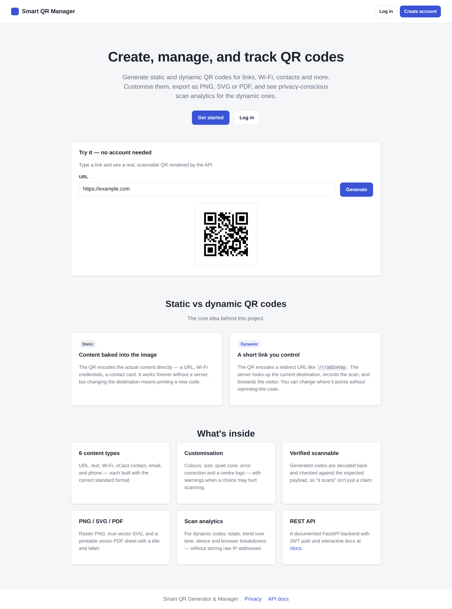
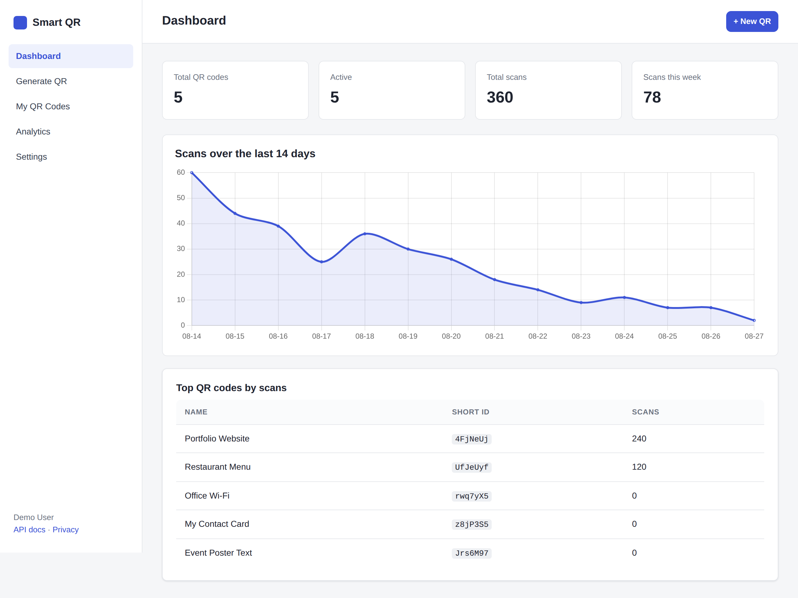
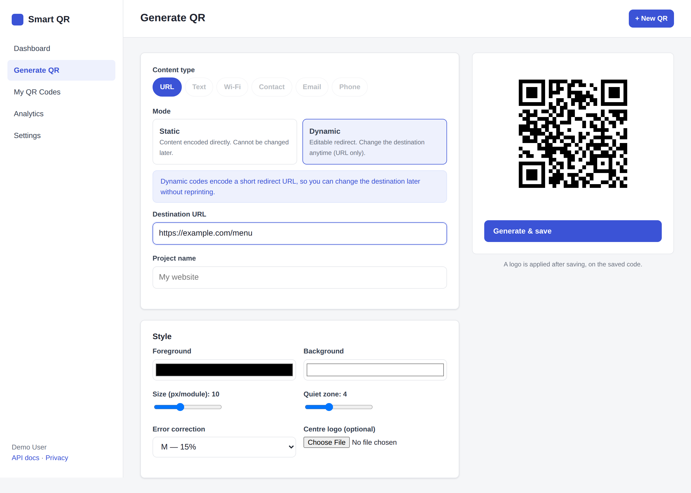
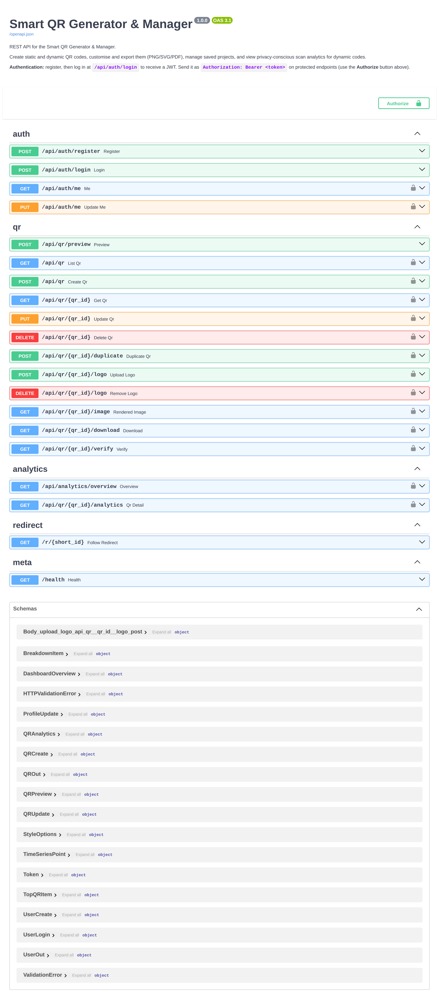

# Smart QR Generator & Manager

A full-stack web application for creating, customising, exporting, and tracking
QR codes. It supports **static** QR codes (content encoded directly into the
image) and **dynamic** QR codes (the image encodes a short redirect URL whose
destination can be changed later without reprinting). Dynamic codes record
privacy-conscious scan analytics.

Built with a FastAPI backend, a plain-JavaScript frontend, and SQLite (with a
PostgreSQL path for production). This is a portfolio project written to be
understood end-to-end, not a one-click template.

---

## What it does

- **Six content types:** URL, plain text, Wi-Fi, vCard contact, email, and phone — each built with the correct standard payload format.
- **Static and dynamic modes.** Dynamic URL codes redirect through `/r/<short_id>`, so you can change where a printed code points at any time.
- **Customisation:** foreground/background colour, size, quiet zone, error-correction level, and a centre logo — with warnings when a choice may hurt scannability.
- **Verified scannable.** Generated codes are decoded back with OpenCV and checked against the expected payload, both in an API endpoint and in the test suite.
- **Exports:** PNG (raster), SVG (true vector), and a printable PDF (QR drawn as vector rectangles with a title and label).
- **Scan analytics** for dynamic codes: totals, a 14-day trend, and device/browser/region breakdowns — without storing raw IP addresses.
- **Accounts & ownership:** register/login with JWT auth; every user only sees and edits their own QR codes (enforced server-side).
- **Documented REST API** with interactive OpenAPI docs at `/docs`.

## Tech stack

| Layer      | Choice |
|------------|--------|
| Backend    | Python 3.11, FastAPI |
| Auth       | JWT (PyJWT) + bcrypt password hashing (passlib) |
| Database   | SQLAlchemy ORM — SQLite (dev), PostgreSQL (prod) |
| QR / images| segno (QR + vector SVG), Pillow (logo), reportlab (PDF), OpenCV (decode-verify) |
| Frontend   | HTML/CSS + vanilla JavaScript, Chart.js (vendored locally) |
| Infra      | Docker + docker-compose, slowapi rate limiting |
| Tests      | pytest (56 tests) |

## Screenshots

| | |
|---|---|
| Landing page |  |
| Dashboard |  |
| Generator (dynamic URL) |  |
| Per-QR analytics |  |
| API docs |  |

## Getting started (local)

Requires Python 3.11+.

```bash
# 1. Create a virtual environment and install dependencies
python -m venv .venv && source .venv/bin/activate      # Windows: .venv\Scripts\activate
pip install -r requirements.txt

# 2. Create your .env from the example and set a real secret
cp .env.example .env
python -c "import secrets; print(secrets.token_urlsafe(48))"   # paste into SECRET_KEY

# 3. (Optional) load synthetic demo data
python -m scripts.seed_data

# 4. Run the app
uvicorn app.main:app --reload
```

Then open <http://localhost:8000>. The API docs are at <http://localhost:8000/docs>.

If you loaded the demo data, you can log in with **demo@example.com / demo1234**.
All demo scans are synthetic and clearly flagged in the app.

## Running with Docker

```bash
docker compose up --build           # SQLite, single container
# or, PostgreSQL:
docker compose --profile postgres up --build
```

> Note: the Docker image and compose file are written and the compose config is
> validated, but the image build was **not** verified in the environment where
> this project was assembled (the container registry was blocked there). Build
> it locally with the command above.

## Running the tests

```bash
pytest -q
```

The suite (56 tests) covers auth, ownership/authorization, QR CRUD, static and
dynamic generation, redirect behaviour, analytics recording and aggregation,
URL/logo validation, exports, and **decode tests** that confirm each generated
QR scans back to the exact intended payload.

## Project structure

```
app/
├── main.py                 # FastAPI app: wiring, routers, static frontend, docs
├── core/                   # config, security (hashing + JWT), logging, rate limit
├── db/                     # SQLAlchemy engine, session, models (User/QRProject/ScanEvent)
├── schemas/                # Pydantic request/response models
├── services/               # business logic (see below)
│   ├── payloads.py         # build + validate the encoded text per content type
│   ├── qr_service.py       # generation, logo pipeline, warnings, decode-verify
│   ├── export_service.py   # PNG / vector SVG / vector PDF
│   ├── redirect_service.py # resolve short_id -> destination, safely
│   ├── analytics_service.py# record scans (privacy-safe) + aggregate
│   └── auth_service.py     # register / authenticate
└── api/
    ├── dependencies.py     # get_current_user, get_owned_project (ownership check)
    └── routes/             # auth, qr, analytics, redirect
frontend/                   # landing, login/register, the app SPA, CSS, JS (vanilla)
tests/                      # pytest suite incl. QR decode tests
scripts/seed_data.py        # synthetic demo data (flagged is_demo)
docs/                       # architecture, security, analytics, deployment, etc.
```

## Documentation

Detailed docs live in [`docs/`](docs/):

- [Architecture](docs/architecture.md)
- [Database design](docs/database.md)
- [QR generation](docs/qr-generation.md) and [static vs dynamic](docs/static-vs-dynamic.md)
- [Security](docs/security.md) and [analytics & privacy](docs/analytics.md)
- [REST API](docs/rest-api.md) and [file generation](docs/file-generation.md)
- [Deployment](docs/deployment.md) and [testing](docs/testing.md)
- [Limitations](docs/limitations.md) and [future improvements](docs/future-improvements.md)

## Security & privacy in brief

- Passwords are stored as bcrypt hashes, never plaintext.
- Authorization is enforced on the server: users can only access their own QR codes; requests for another user's id return 404.
- Redirect destinations are restricted to `http`/`https`; `javascript:`, `data:`, and other schemes are rejected.
- Scan analytics never store a raw IP address — only a salted, truncated hash plus coarse device/browser/OS fields. See the [privacy notice](frontend/privacy.html) and [analytics doc](docs/analytics.md).

## Limitations (honest)

Scan location is approximate, user-agent detection is imperfect, analytics can be
inflated by bots or repeat scans, and no system guarantees every generated QR
scans in every physical condition. Automatic scan verification runs in tests and
via an endpoint using OpenCV; it is not a guarantee for every real-world camera.
Full details in [docs/limitations.md](docs/limitations.md). Performance,
uptime, and similar numbers are **not measured** and are not claimed.
